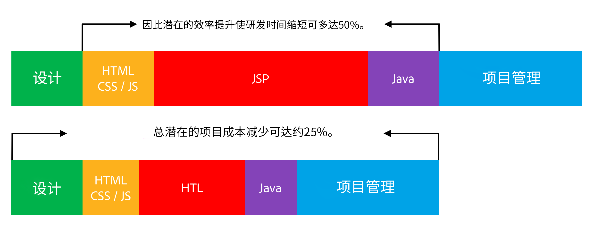

# 概述 {#overview}

Adobe Experience Manager (AEM) 支持 HTML 模板语言 (HTL) 的目的在于提供可增加安全性的高效企业级 Web 框架，并让不了解 Java 的 HTML 开发者更好地参与 AEM 项目。

[在 AEM 6.0 中引入的 ](history.md)HTML 模板语言是 AEM 中适用于 HTML 的首选和推荐的服务器端模板系统。 对于需要构建强大企业网站的 Web 开发者来说，HTML 模板语言有助于提高安全性和开发效率。

## 提高了安全性 {#increased-security}

与大多数其他模板系统相比，如果在站点实施中使用了 HTML 模板语言，就会增强站点的安全性，因为 HTL 能够自动将正确的上下文感知型转义应用于输出到表示层的所有变量。HTL 之所以能够做到这一点，是因为它理解 HTML 语法，并由此根据表达式在标记中的位置调整表达式所需的转义。例如，这会导致置于 `href` 或 `src` 属性中表达式的转义与置于其他属性或其他位置中的表达式转义不同。

虽然使用 JSP 等模板语言可以实现同样的结果，但开发者必须手动确保将正确的转义应用于每个变量。 由于所应用转义中的单个遗漏或错误就可能足以造成跨站点脚本编制 (XSS) 漏洞，因此我们决定使用 HTL 自动执行这项任务。如果需要，开发者仍可以对表达式指定不同的转义，但是使用 HTL，默认行为更有可能与所需行为对应，从而降低出错的可能性。

## 简化了开发 {#simplified-development}

HTML 模板语言易于学习，且其功能经过刻意限制，可确保既简单又直接。它还拥有强大的机制来构造标记和调用逻辑，同时始终严格隔离标记和逻辑间的问题。HTL 本身是标准的 HTML5，因为它使用表达式和数据属性，通过所需的动态行为对标记进行注释，这意味着它不会破坏标记的有效性，并让标记始终可读。请注意，表达式和数据属性的求值完全在服务器端完成，不会出现在客户端，可在客户端不受干扰地使用任何所需的 JavaScript 框架。

这些功能让不了解 Java 且对产品也一知半解的 HTML 开发者能够编辑 HTL 模板，让他们成为开发团队的一部分，并简化了与全栈 Java 开发者的协作过程。反过来，这也让 Java 开发者能够专注于后端代码，而无需担心 HTML。

## 降低了成本 {#reduced-costs}

提高了安全性，简化了开发过程，同时加强了团队合作，这相应地减少了 AEM 项目的工作量，缩短了其上市时间 (TTM)，并降低了总体拥有成本 (TCO)。

具体地，从使用 HTML 模板语言重新实施 Adobe.com 站点来看，项目成本和持续时间缩短了约 25%。

上图显示了 HTL 可能提供的以下效率改进：

* **HTML / CSS / JS：**&#x200B;由于 HTML 开发者能够直接编辑 HTL 模板，因此前端设计不必再与 AEM 项目分开实施，而可以直接在实际 AEM 组件上实施。这减少了全栈 Java 开发者所面临的费时费力的迭代工作。
* **JSP / HTL：**&#x200B;由于 HTL 本身不需要任何 Java 知识并且可以直接编写，因此任何拥有 HTML 专业知识的开发者都可以编辑模板。
* **Java：**&#x200B;由于 HTL 提供的 Use-API 使用起来简单明了，因此明确了与业务逻辑的接口，这也有利于 Java 的整体开发。

## 视频介绍 {#video}

以下来自 [AEM Gems 会话的视频，](https://experienceleague.adobe.com/docs/experience-manager-gems-events/gems/gems2014/aem-introduction-to-htl.html)概述了 HTL 的目的以及实施示例。

>[!VIDEO](https://video.tv.adobe.com/v/19504/?quality=9)

请注意，视频中是以[其原名 Sightly 指代 HTL。](history.md)

## 后续步骤 {#next-steps}

现在您已经了解了 HTL 的目的和优势，可以通过查看文档[开始使用 HTML 模板语言](getting-started.md)来开始使用该语言。
